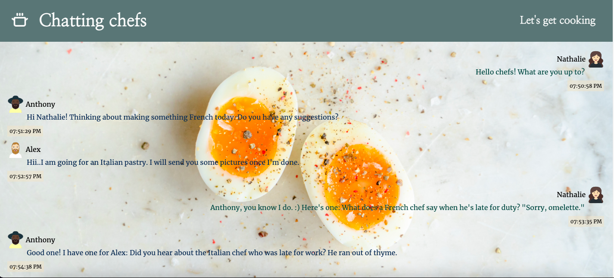
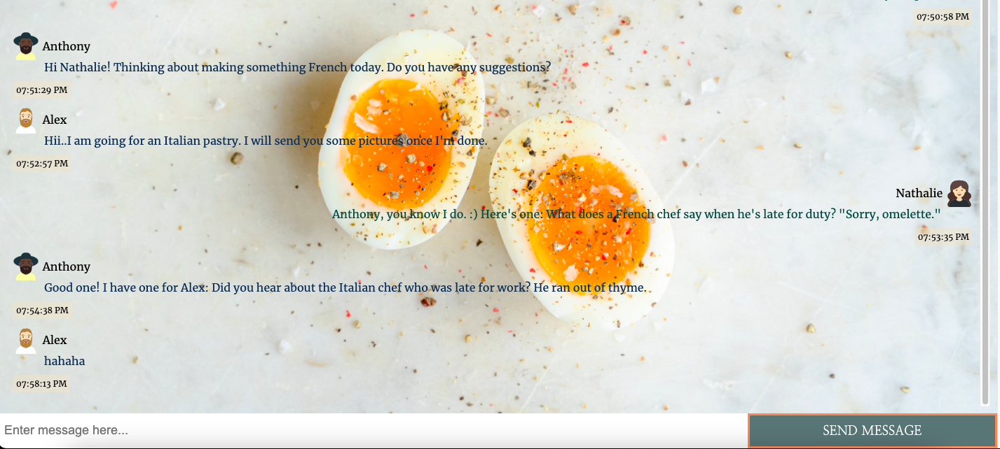

# Cooking Chat App made with Scaledrone

Final exam for Algebra course for Frontend developer - React Chat App

**Try it out**

- https://bjakas-cooking-chat-app.netlify.app/

## Instructions

- `npm install`
- `npm run start`
- `npm run build`

## Tools used

- HTML5
- CSS
- React
- Scaledrone

## Features

- enter your name
- choose avatar of your liking
- preview your name and avatar
- send messages in real time with timestamp included

## Images of Chat App

